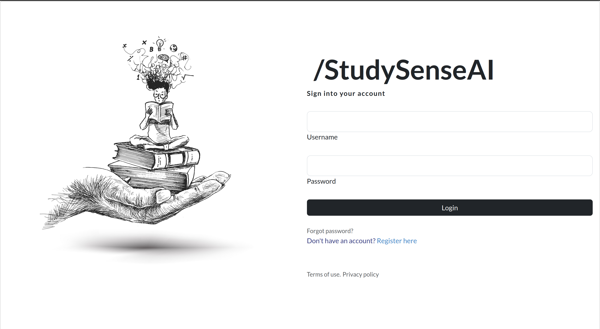

#  **StudySense.AI**


[](https://www.python.org/)
[](https://github.com/gobbledy-gook/report.ai/blob/main/LICENSE)
[](https://github.com/psf/black)


### A PDF Reader to Focus and Gather your data.

A web application that allows users to easily upload and organize PDF files.
With intuitive **folder organization**, users can keep their PDFs in order and focus on each document without distractions. The application also provides **valuable analytics** on reading habits.  
Users can track the time spent on each PDF, gain insights into daily reading time, and identify popular reads.  
With secure authentication using tokens, users can confidently manage their PDFs while ensuring **data privacy**.

<br>

## **Quick Start**

1. The Django rest backend is present in `./study_sense`
2. The React frontend can be found in `./studySenseClient`
3. Make sure you've installed necessary packages through `npm install`
4. Django runs in `port:8000` and React in `port:5173` by default
5. Open terminal and run

```bash
chmod +x dev.sh
./dev.sh
```

---

## **Highlights**

1. **Organize into folders:** Can organize the PDFs into a folder.

2. **Access Anywhere:** Your Files and data are synced with the cloud, access it from anywhere

3. **Analytics:** Get an understanding of your study sessions.

4. **Security:** Secure Authentication using Tokens.

---

<!-- ### Screenshots


 -->

<details>
    <summary>Screenshots</summary>
    <h1>Screenshots</h1>
    
    <h3>Secure authentication</h3>
    <br>
    
    <h3>Detailed Analytics</h3>
    <br>
    
    <h3>Distractionless UI</h3>
    <br>
</details>

---

### How to Give Feedback

We encourage your feedback! You can share your thoughts with us by:

- [Opening an issue](./issues) in the repository

---

### Contribution Guidelines

For information on how to contribute to this project, please take a look at our [contribution guidelines](./CONTRIBUTING.md).
