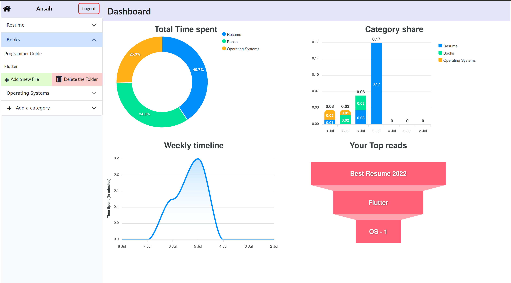
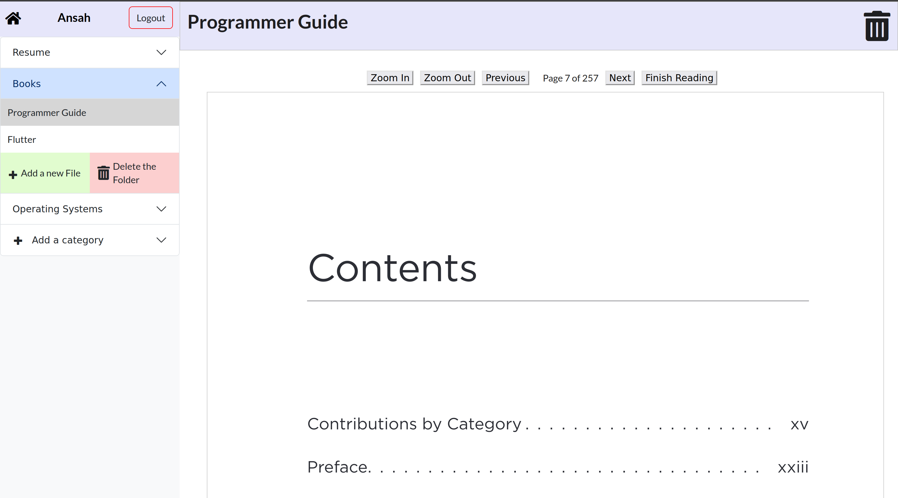

#  **StudySense.AI**


[](https://www.python.org/)
[](https://github.com/gobbledy-gook/report.ai/blob/main/LICENSE)
[](https://github.com/psf/black)


### Organize and Focus on your PDFs at one place

A web application that allows users to easily upload and organize PDF files.
With intuitive **folder organization**, users can keep their PDFs in order and focus on each document without distractions. The application also provides **valuable analytics** on reading habits.  
Users can track the time spent on each PDF, gain insights into daily reading time, and identify popular reads.  
With secure authentication using tokens, users can confidently manage their PDFs while ensuring **data privacy**.

<br>

## **Quick Start**

1. The Django REST backend is located in `./study_sense`
2. The React frontend can be found in `./studySenseClient`
3. Install the necessary packages by running npm install. `npm install`
4. Django runs on `port 8000`, and React runs on `port 5173` by default.
5. Open the terminal and execute the following command:

```bash
chmod +x dev.sh
./dev.sh
```

---

## **Highlights**

1. **Organize into folders:** Can organize the PDFs into a folder.

2. **Access Anywhere:** Your Files and data are synced with the cloud, access it from anywhere

3. **Analytics:** Get an understanding of your study sessions.

4. **Security:** Secure Authentication using Tokens.

---

### Screenshots
|                   |              |
| ---------------------------- | ---------------------- |
| Secure authentication        |  |
| Detailed Analytics           |  |
| Distractionless UI           |  |


---

### How to Give Feedback

We encourage your feedback! You can share your thoughts with us by:

- [Opening an issue](./issues) in the repository

---

### Contribution Guidelines

For information on how to contribute to this project, please take a look at our [contribution guidelines](./CONTRIBUTING.md).
